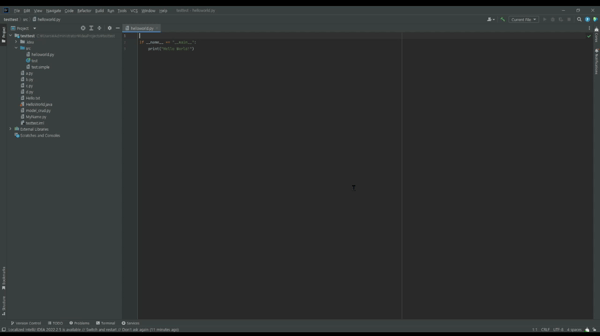
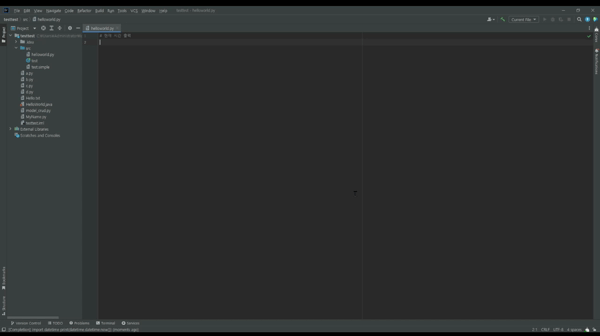
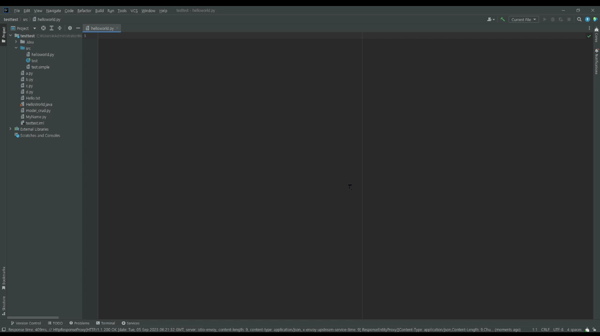

인텔리제이, 파이참 등 JetBrains IDE 용 Code Completion 플러그인입니다.

## 플러그인 활성화

### 사용 등록
플러그인의 기능을 사용하기 위해서는 사용자 등록 시 발급 받은 `API Key`를 플러그인에 등록해야 합니다.

#### 등록 방법
1. `Corus` 툴 윈도우를 열고 `Config` 탭을 클릭합니다.
2. `Config` 탭 내 `API Key 입력` 부분에 발급 받은 `API Key`를 입력합니다.

## 기능 목록
### Code Completion
사용자가 현재 파일의 사용 중인 코드와 관련된 추천 코드를 요청하고, 10건 이내의 추천 결과에서 원하는 코드를 선택할 수 있는 기능입니다.

#### 사용 방법
1. 코드 파일을 열고, 커서가 있는 위치에서 단축키 `ctrl+alt+1` 또는 `마우스 우클릭 > Corus > Completion` 메뉴를 선택합니다.
2. `Corus` 툴 윈도우에 결과가 출력되고, 추천 코드 아래에 있는 `Accept` 링크를 누르면 해당 코드가 반영됩니다.  

### 코드 자동추천 in Editor
코드를 자동 추천하는 기능입니다. 추천되는 코드는 *회색의 이탤릭체*로 표시됩니다.

#### 사용 방법
* 코드가 추천되고 `TAB`키를 누르면 코드 전체가 반영됩니다. 
* 추천 코드를 따라 타이핑을 하면 타이핑한 코드가 반영됩니다. 단, 추천 코드와 다른 키를 입력하면 추천 코드가 사라집니다.
* 방향키(`PgDn`, `End`, `→`, `↓`)를 누르면 커서가 이동한 만큼 코드가 반영됩니다. 단, `PgUp`, `←`, `↑`을 누르면 추천 코드가 사라집니다.  
* `ESC`키를 누르면 추천 코드가 사라집니다.

#### 자동추천 기능 발동 시점
* 빈 화면이 로딩되면 코드가 자동 추천 됩니다.
* 마지막 키 입력 이후 2초가 지나면 코드가 자동 추천 됩니다.
* 코드 추천이 진행되면 화면 하단의 상태바 아이콘이 스피너로 바뀝니다. ( → )
* `코드자동추천 허용` 상태인 경우에만 동작합니다.

#### 코드자동추천 on/off 방법
코드자동추천 기능을 on/off 하는 방법입니다.
* 단축키 `ctrl+alt+0` 또는 `마우스 우클릭 > Corus > 코드자동추천 허용 메뉴`를 선택하면 해당 기능이 토글됩니다.
* 상태바의 아이콘(, )을 클릭하면 해당 기능이 토글됩니다. 

<!--
## 설치방법
1. [`corus-1.0.jar`](http://168.62.175.129:9988/static/plugins/jetbrains/corus-1.0.jar)를 로컬 디스크에 다운로드 받는다.
2. IDE(인텔리제이, 파이참)를 실행한다.
3. 파일 > 설정 > 플러그인으로 들어가서 우측 상단 설정 버튼(톱니바퀴 모양)을 클릭하고, `디스크에서 플러그인 설치`를 선택한다.
4. 다운로드 받은 `corus-1.0.jar`를 지정하면 설치를 진행하게 된다.
5. 경우에 따라 IDE를 재실행한다.

### Code Explanation
1. 코드 파일에서 설명을 원하는 코드를 블록으로 잡고, 단축키 `ctrl+alt+2` 또는 `마우스 우클릭 > Corus > Explanation` 메뉴를 선택한다.
2. `Corus` 툴 윈도우에 결과가 출력된다.

### Code Comment
1. 코드 파일에서 설명을 원하는 코드를 블록으로 잡고, 단축키 `ctrl+alt+3` 또는 `마우스 우클릭 > Corus > Comment` 메뉴를 선택한다.
2. `Corus` 툴 윈도우에 결과가 출력되고, `Accept` 링크를 누르면 해당 코드가 반영된다.

### Test Code Generation
1. 코드 파일에서 설명을 원하는 코드를 블록으로 잡고, 단축키 `ctrl+alt+4` 또는 `마우스 우클릭 > Corus > Test Code Generation` 메뉴를 선택한다.
2. `Corus` 툴 윈도우에 결과가 출력되고, `Accept` 링크를 누르면 해당 코드가 반영된다.

### Corus Chat
1. IDE 우측에 있는 `Corus` 툴 윈도우 내 `Corus Chat` 탭을 선택한다.
2. 패널 하단에 있는 입력 창에 질문을 입력하고, Enter 키 또는 Submit 버튼을 누른다.
3. "Clear All" 링크를 클릭하면 이전 히스토리가 삭제된다.

## 제공기능
- Code Completion: 코드 추천 및 완성
- Code Explanation: 코드 분석/설명
- Code Comment 생성: 코드에 대한 주석 생성
- Test Code Generation: 테스트 코드 생성
- Corus Chat: 챗 형태 질의응답
- (예정) Code Translation: 다른 언어로 변환
- (예정) Bug fix

## Q&A
**Q: 코드가 중간에 잘려요.**  
**A: `max_token`이 300으로 설정되어 최대 300자까지만 받아오고 있습니다. (튜닝 사항입니다.)**

**Q: 코드 블록을 안 잡았을 때 어디까지 코드가 요청되나요?**  
**A: 커서 앞쪽으로 100글자를 전송하고 있습니다. (튜닝 사항입니다.)**

**Q: 단축키가 마음에 안들어요.**  
**A: 설정 > 키맵 or keymap 검색 > 플러그인 > Corus에서 단축키를 바꿀 수 있습니다.**

## 피드백 반영 및 개선 사항
- 6/1: 블록을 잡은 경우, 블록 다음에 코드 반영 (류창희M 요청건)
- 6/2: 코드 삽입 후 삽입 내용 블록으로 강조 (전미숙M 요청건)
- 6/2: Backend API 변경 건 반영
- <strike>6/2: 전송 prompt 개선: 블록 코드만 전송 -> The filename is {filename}. Show me the next code of {code}. 형식으로 변경. (파일 형식에 따라 코드 생성 방식을 명확화함.)</strike> Backend에서 prompt를 구성하도록 변경함.
- 6/7: Explanation 기능 추가
- 6/7: Chatbot 용 화면 추가

## 개발 관련
- Caret : 에디터에서 현재 편집 위치를 나태내는 깜박이는 커서
-->