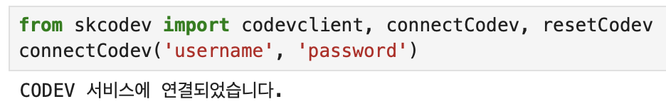
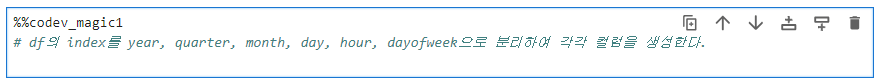
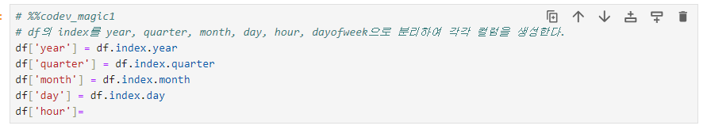
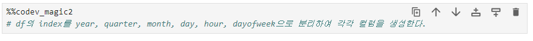
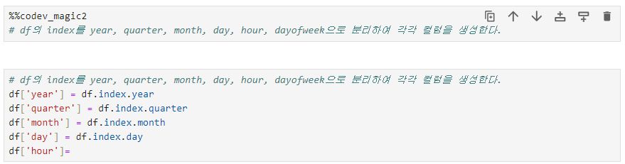
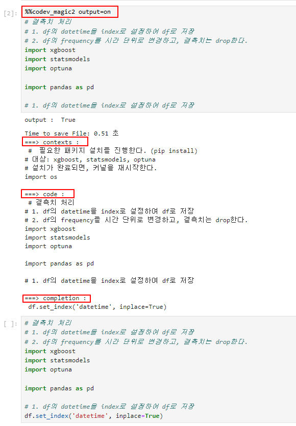
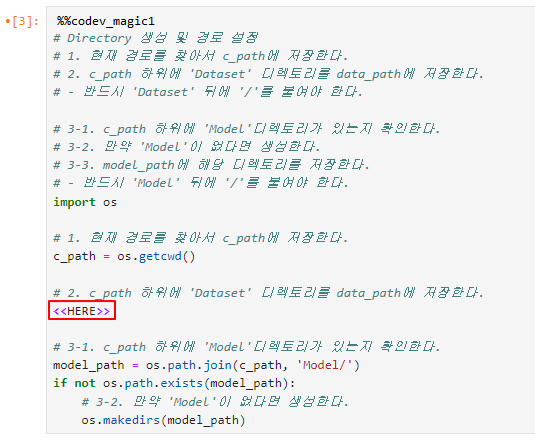
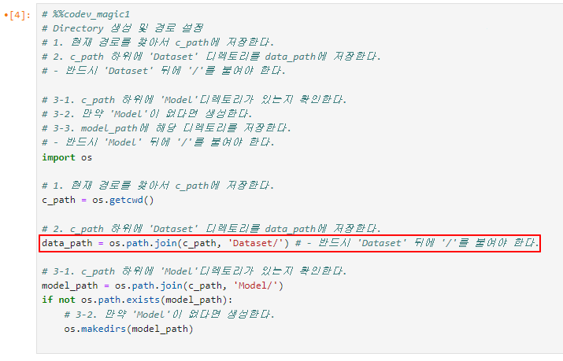
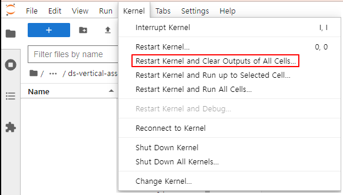

# JupyterLab 설정하기

Jupyterlab 용 Code Completion  pip 패키지 소스 입니다.  

## AICoding 사용자 등록하기

- 사용자등록 신청 메뉴얼을 참고하여 신청 (username, password 확인)

---

## Codev Client package 설치

### Package **설치**

- pip 를 사용하여 github repository 의 jupyter codevclient package 설치
    
    : *pip install skcodev*

---

## Codev Client 사용하기

### **모듈 불러오기**

- 사용자 등록한 username, password 사용
    
    
    

### **기존 Cell 에 code 추천받기**

- “%%codev_magic1” magic command 를 Cell 상단에 작성하고 실행
    
    : 실행전
    
    
    
    :실행후 (code 추천)
    
    
    

### **새로운 Cell 에  code 추천받기**

- “%%corus_magic2” magic command 를 Cell 상단에 작성하고 실행
    
    : 실행전
    
    
    
    : 실행후 (code 추천)
    
    
    

### **Contexts output 보기**

- output=on parameter 사용하여 context ,code, completion 확인 가능
    
    : output 설정은 한번 하면 계속 유효
    
    : contexts - 상위 Cell 에서 실행된 명령어 병합
    
      **( codev_magic 포함 Cell 제외, Cell execution_count 없는 Cell 제외)**
    
    : code - 실행된 Cell 구문
    
    : completion - 추천 Code
    
    
    

### 추천 Code 위치 지정하기

- “<<HERE>>” Tag 를 추천받기 원하는 위치에 작성, 없으면 마지막 라인에 추천
    
    : 실행전
    
    
    
    :실행후 (code 추천)
    
    
    

### Kernel 초기화하기

- Codev Client 지속적인 오류가 발생할 때 Kernel 초기화

