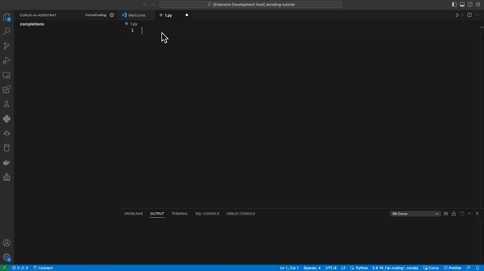
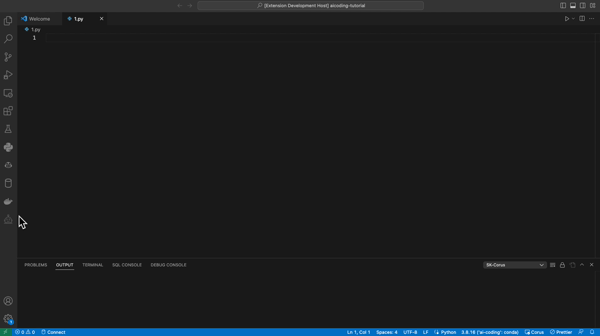
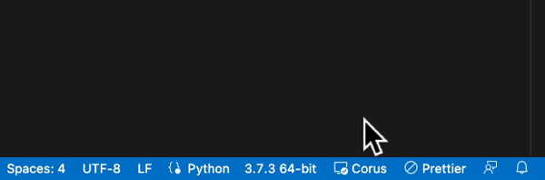
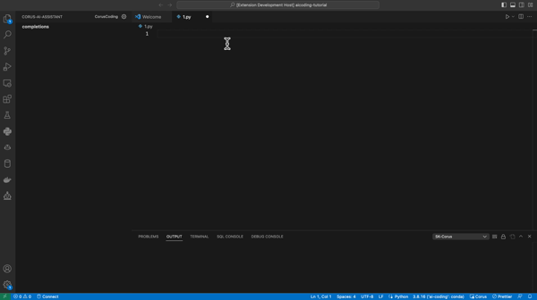

## Corus: Your AI Assistant In VS Code

Receive code suggestions in real time and work on code in the IDE!

#### Quick Menu:

- [서비스 소개](#서비스-소개)

- 가이드라인
  
  - [사용자 등록](#사용자-등록)
  
  - [제공 기능 - Code Suggestion in Editor](#제공-기능---editor-상에서-코드-자동-추천-code-suggestion-in-editor)
  
  - [제공 기능 - Code Completion](#제공-기능---code-completion)

- [FAQ](#faq)

## 서비스 소개

Corus는 효율적으로 코드 작업을 할 수 있도록 도와주는 AI assistant입니다. 

- 작업중인 editor에서 실시간 코드 제안을 제공합니다.

- 코드 제안이 필요한 경우, 가능한 다수의 완성된 코드를 제안합니다.

- 다양한 code language와 IDE를 지원합니다.

## 가이드라인

### 사용자 등록

해당 페이지로 이동하여, extension 사용을 위해 사용자 등록을 수행합니다. 

Corus를 사용하기 위해서는 사용자 등록 시 발급 받은 `API Key`를 플러그인에 등록해야 합니다.

    1. 왼쪽 사이드 바의 Corus Icon을 클릭 합니다. ()

    2. 상단에 위치한 설정을 선택합니다. (설정 - )

    3. 설정 탭 내 `API Key` 입력 칸에 발급 받은 `API Key` 를 입력합니다. 

### 제공 기능 - Editor 상에서 코드 자동 추천 (Code suggestion in Editor)

작업중인 Editor에서 코드를 자동으로 추천하는 기능입니다. 

사용자 화면에 보여지는 코드는 *suggestion code* 와 같이 표시됩니다.

#### 사용 방법

* 추천 받은 코드를 수락하고 싶은 경우 `TAB`키를 누르면 추천 코드 전체가 반영됩니다. 
* 추천 코드를 따라 타이핑을 하면 타이핑한 코드가 반영됩니다. 단, 추천 코드와 다른 키를 입력하면 추천 코드가 사라집니다.
* 방향키 혹은 `ESC` 키를 입력할 경우, 추천 코드를 거절할 수 있습니다.
* 추천 코드 요청중인 경우, 화면 하단의 상태바 아이콘이 spinner 형태로 전환됩니다. 

#### 코드 자동 추천 on/off

코드 자동 추천 기능을 on/off 를 다음과 같이 설정할 수 있습니다. 

- window: `ctrl+alt+0` / mac: `cmd+option+0` 를 통해 on/off 할 수 있습니다.

- `마우스 우클릭 > Corus > 코드자동추천 허용` 메뉴를 선택하여 on/off 할 수 있습니다.

- 하단 상태바를 클릭하여 on/off 를 설정할 수 있습니다.

### 제공 기능 - Code Completion

사용자가 현재 작업중인 에디터에서 코드 추천을 요청할 수 있습니다.  최대 10건 이내의 추천 결과에서 원하는 코드를 선택할 수 있습니다. 

#### 사용 방법

작업중인 파일에서, 현재 커서가 있는 위치에서 다음과 같은 방법으로 요청을 보낼 수 있습니다.

- window: `ctrl+alt+1`  / mac: `cmd+option+1` 을 통해 코드 요청합니다.

-  `마우스 우클릭 > Corus > Completion` 메뉴를 선택합니다.

- 사이드바 completion tab에 위치한 completion 버튼을 클릭 합니다. 
 ()

## 단축키 안내

| **기능 목록**          | **단축키**                                        |
| ------------------ | ---------------------------------------------- |
| 추천 코드 수락           | Tab                                            |
| 추천 코드 거절           | ESC / Enter / 방향키                              |
| 코드 자동 추천 on/off    | ctrl+alt+0 (window/linux) / cmd+option+0 (mac) |
| Code Completion 요청 | ctrl+alt+1 (window/linux) / cmd+option+1 (mac) |

## FAQ

해당 서비스와 관련하여 추가 문의사항이 있을 경우,

Contact: [aicoding@sk.com](mailto:aicoding@sk.com) 로 문의하시길 바랍니다.
